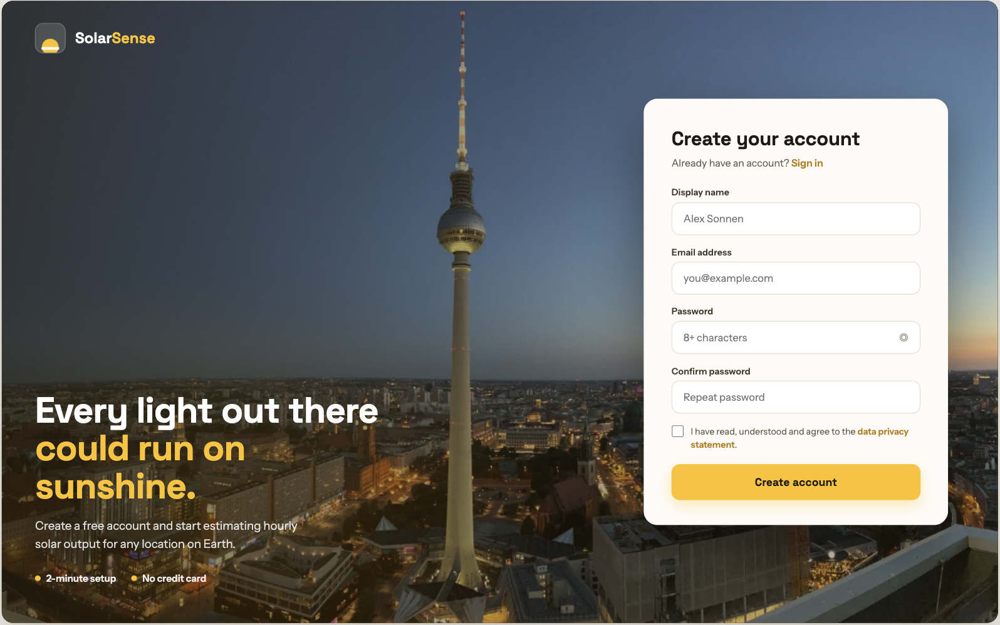
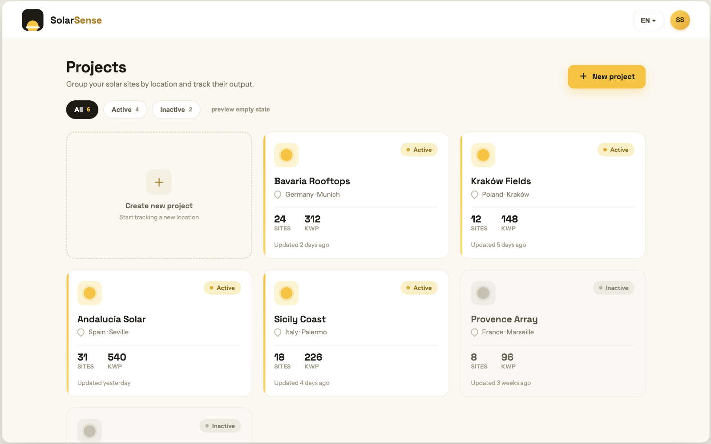
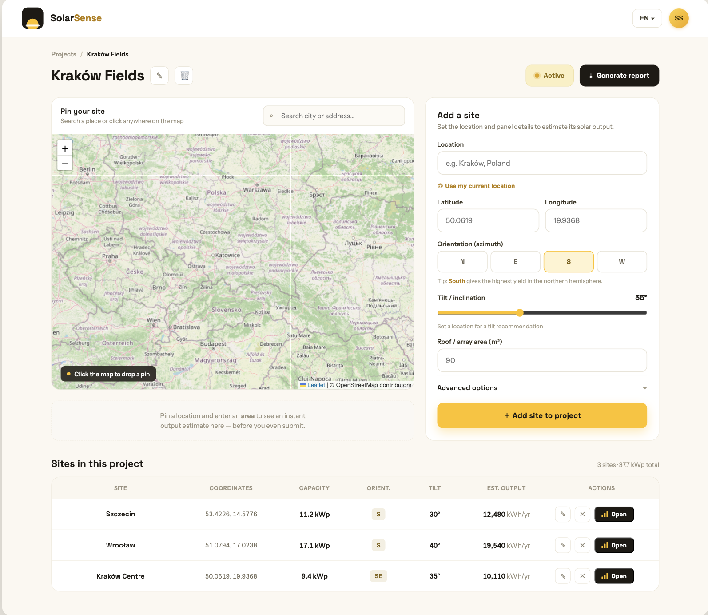
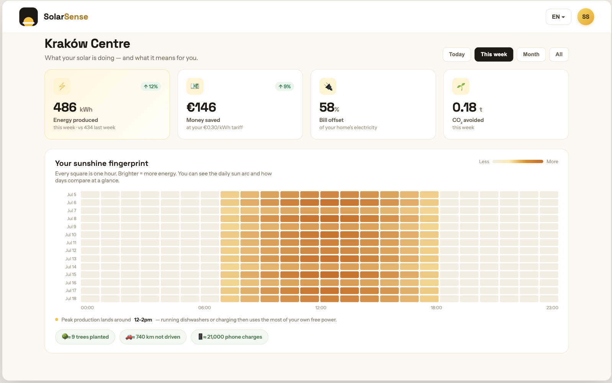

# ☀️ SolarSense

**Pick any spot on the map and see exactly how much solar energy your panels could generate — down to the hour.**

SolarSense estimates and tracks photovoltaic output for any location on Earth. Pin a roof on the map, describe the panels, and get an instant production estimate backed by real satellite-derived solar data — then watch the site build up its own hourly production history and homeowner-friendly insights.




---

## The story

This project began as **"PV System"**, my university project for the *Database and Web Techniques* course at Technische Universität Chemnitz — a classic MERN-stack app (MongoDB, Express, React, Node) for monitoring photovoltaic data.

In 2026 I revisited it and rebuilt it end to end into **SolarSense (v2)**: a complete redesign with a new brand and UI, a new data layer, real solar science instead of a paid weather API, and a set of features the original never had. Almost no v1 code survives — what remains is the idea, made properly.

| | v1 — PV System (university) | v2 — SolarSense (this repo) |
| --- | --- | --- |
| Database | MongoDB + hand-rolled JWT auth | **Supabase** (Postgres, Auth, Row Level Security) |
| Language | JavaScript | **TypeScript** everywhere (client + server, strict) |
| Build tooling | Create React App | **Vite** (~0.5 s builds) |
| Solar data | Weatherbit (limited free tier) | **Open-Meteo + PVGIS + Nominatim** — all free & keyless |
| UI | Material template with sidebar | Custom **SolarSense design system** (warm yellow/ink, top-bar shell) |
| Insights | Raw output charts | Money/CO₂ insight cards, sunshine-fingerprint heatmap, instant estimates |

---

## Features

### 🔐 Accounts (Supabase Auth)
- Sign up / sign in, **forgot & reset password** via email link
- Account settings: edit display name, change password (live **strength meter** + match check, signs out other devices), delete account with **password re-confirmation** — everything cascades

### 📁 Projects — the home page
- Projects as cards with status (Active/Inactive), site count, total kWp, and "Updated X ago"
- **Automatic location labels** rolled up from each project's sites: same city → *Munich · Germany*, same state → *Bavaria · Germany*, same country → *Germany*, spread out → *3 countries* (no manual typing — sites are reverse-geocoded when saved)
- Filter chips (All / Active / Inactive); a project activates itself when its first site is added



### 📍 Project detail — plan a site
- **Interactive Leaflet map**: click to drop a pin or search any place (OpenStreetMap Nominatim)
- Add-site form: orientation (N/E/S/W), tilt slider with a **latitude-based recommendation**, area, module type (mono/poly/thin-film), mounting (roof/ground/tracker), system losses (with an explainer tooltip) and electricity tariff
- **Instant Estimate card** — updates on every keystroke: system size (kWp), yearly output, yearly savings (€), CO₂ avoided, plus a **12-month output chart**. Numbers appear instantly from a client-side model, then quietly refine to **real PVGIS simulation data** once you stop typing ("Source: PVGIS")
- Sites table with per-site capacity and estimated annual output; designed empty states for brand-new projects



### 📊 Insights — per site, homeowner-first
- Period switcher (Today / This week / Month / All) — one fetch, instant switching
- Four insight cards: **Energy produced** (with % delta vs the previous period), **Money saved** at your tariff, **Best day**, **CO₂ avoided**
- **Sunshine fingerprint**: a heatmap of every recorded hour (one row per day, brighter = more energy) that makes the daily sun arc and weather differences visible at a glance, with a computed peak-production window ("Peak lands around 12–2pm — run the dishwasher then")
- CO₂ equivalence chips (trees planted · km not driven · phone charges)
- Graceful **cold-start state** while the first 24 hourly readings are collected



### ⚙️ Under the hood
- An **hourly cron** records every site's actual panel-plane irradiance and computed energy — data collection starts the moment a site is created
- All solar/geo data comes from **free, keyless APIs** — the app runs without a single paid subscription

---

## How the numbers work

| Source | What it provides | Used for |
| --- | --- | --- |
| [Open-Meteo](https://open-meteo.com/) | Hourly **global tilted irradiance** (GTI) on the exact panel plane (tilt + azimuth) | Hourly production recording (cron) |
| [PVGIS](https://re.jrc.ec.europa.eu/pvg_tools/en/) (EU JRC) | Climatological simulation from ~16 years of satellite data | Authoritative annual + per-month estimates (typical year) |
| [Nominatim](https://nominatim.org/) (OSM) | Geocoding + reverse geocoding | Map search, automatic project locations |

Energy per hour: `kWh = GTI (W/m²) × area (m²) × module efficiency × (1 − losses%) ÷ 1000`, with module efficiency from Wp/m² (mono 205 / poly 175 / thin-film 120). CO₂ uses a ~0.38 kg/kWh grid factor.

---

## Tech stack & architecture

**Frontend** — React 18 · TypeScript (strict) · Vite · MUI v5 styled with custom SolarSense design tokens · Redux (+ redux-persist) · React Router 6 · Leaflet / react-leaflet · axios (Supabase session token attached via interceptor)

**Backend** — Node.js + Express in TypeScript (NodeNext ESM, `tsx` in dev) · Supabase JS (service-role) · node-cron · PDFKit + Nodemailer (report generation)

**Database** — Supabase Postgres: `profiles`, `projects`, `products` (sites), `pv_readings` (hourly), with RLS policies and a signup trigger. One idempotent baseline migration sets up everything: [`supabase/migrations`](supabase/migrations).

```
React (Vite, :3000)
   │  REST /api/*  (Bearer <supabase access token>)
   ▼
Express API (:5500) ── verifies token, owns all queries (service-role key)
   │                      │
   │  hourly cron         ├── Open-Meteo  (hourly GTI per site)
   ▼                      ├── PVGIS      (annual + monthly estimates)
Supabase Postgres         └── Nominatim  (reverse geocoding at site save)
(+ Supabase Auth: signup/login/reset directly from the client)
```

---

## Getting started

**Prerequisites:** Node 20+, a free [Supabase](https://supabase.com/) project.

1. **Database** — in the Supabase dashboard, open *SQL Editor* and run [`supabase/migrations/20260703000000_schema.sql`](supabase/migrations/20260703000000_schema.sql). One file, whole schema.

2. **Environment** — copy the templates and fill in your Supabase values (*Settings → API Keys*):

   ```bash
   cp .env.example .env.development        # client: VITE_API_URL, VITE_SUPABASE_URL, VITE_SUPABASE_PUBLISHABLE_KEY
   cp server/.env.example server/.env      # server: SUPABASE_URL, SUPABASE_SERVICE_ROLE_KEY (secret), PORT, REPORT_FROM_EMAIL
   ```

   The client uses the **publishable** key (safe in the browser, RLS applies); the server uses the **secret** key (bypasses RLS — never expose it).

3. **Install & run**

   ```bash
   npm install
   (cd server && npm install)
   npm start        # client on :3000 and API on :5500, in parallel
   ```

4. **Other scripts** — `npm run build` (type-check + production build to `build/`), `npm run preview`, `npm run lint`; in `server/`: `npm run typecheck`, `npm run build` + `npm run start:prod`.

---

## Project structure

```
├── src/                     # React app
│   ├── pages/               # ProjectPage (home), ProjectDetailPage, InsightsPage, AccountSettingsPage, auth pages
│   ├── sections/            # feature components (projects/, insights/, settings/, auth/)
│   ├── layouts/solarsense/  # top-bar app shell + account dropdown
│   ├── theme/               # MUI theme + solar design tokens
│   ├── hooks/               # usePvgisEstimate (debounced live estimates)
│   ├── store/               # redux (user session state)
│   └── utils/               # api client, supabase client, solar estimate math
├── server/                  # Express API (TypeScript)
│   ├── routes/              # project / product / solar / user
│   ├── solar.ts             # Open-Meteo + PVGIS + energy math
│   ├── geocode.ts           # Nominatim reverse geocoding
│   └── cornCalculatePS.ts   # hourly readings cron + 30-day report
└── supabase/migrations/     # single baseline schema
```

---

## License

[MIT](LICENSE.md) © 2026 Satvik Sabharwal. Small portions of the MUI theme configuration derive from the Minimal UI free template (see LICENSE.md).
